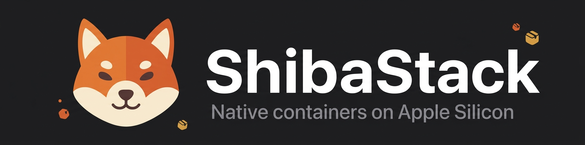

<p align="center">
  
</p>

<p align="center">
  <b>Native, Docker-free container manager for Apple Silicon.</b><br/>
  Runs OCI containers on Apple's <code>container</code> runtime — with a SwiftUI dashboard, live stats,
  user-space DNS + reverse proxy, and a Docker-CLI-compatible socket.
</p>

<p align="center">
  
  
  
</p>

---

ShibaStack is a native macOS app and CLI suite for managing Linux containers on Apple Silicon using **Apple's own `container` runtime** — no Docker daemon required. It adds a polished SwiftUI dashboard and menu-bar app, a zero-sudo user-space network layer that gives every container a friendly `*.apc.local` domain, and a Docker-API-compatible socket so existing Docker tooling can talk to the Apple-container engine.

> **The container engine is only Apple's `container`** (`/usr/local/bin/container`). "Docker" appears here in just two places: the default image-registry hostname `docker.io` (Docker Hub), and an optional compatibility socket that *translates* Docker API calls into `container` commands. There is no Docker daemon.

---

## Features

- **Real OCI containers on Apple's runtime** — create, run, exec, inspect, start/stop/delete, all driven through Apple's `container` CLI. Container, image, and volume lists are live.
- **Live resource metrics** — real per-container CPU + memory sampled from the guest cgroup, plus real host CPU, shown live in the dashboard.
- **Streaming logs & in-container shell** — follow `container logs -f` live, and run a shell directly inside the selected container via `container exec`.
- **Container filesystem & inspect** — browse the real container root filesystem, and view real `inspect` output including environment variables and mounts.
- **Zero-privilege networking** — a user-space UDP DNS resolver for `*.apc.local` and an HTTP reverse proxy with a loop guard, no root or sudo. Service status is probed live, not assumed.
- **Docker-CLI compatibility** — a `~/.apc/docker.sock` bridge translates Docker API requests into `container` commands, so `docker ps`, Testcontainers, and similar tools work against the Apple engine.
- **Native SwiftUI app + menu bar** — a multi-pane dashboard with container, image, and volume managers, and a menu-bar controller.

---

## Requirements

- Apple Silicon Mac, macOS 15 or later
- Apple's `container` runtime at `/usr/local/bin/container` — [apple/container releases](https://github.com/apple/container/releases)
- Go and the Xcode / Swift toolchain (to build from source)

---

## Honest status

ShibaStack drives a **real** OCI runtime. Two areas are limited by the platform, and the UI says so plainly:

- **Virtualization VM** — running a VM through `Virtualization.framework` needs Apple's restricted `com.apple.security.virtualization` entitlement. On ad-hoc-signed development builds the VM lifecycle falls back to a local agent; container operations stay real because Apple's `container` already runs each container in its own lightweight VM.
- **USB passthrough** — host USB *scanning* is real (IOKit). *Attaching* a device to a guest requires a running VM with the entitlement; when unavailable the UI disables it and explains why instead of faking success.

---

## Build

```bash
git clone https://github.com/AntApper/ShibaStack.git
cd ShibaStack
./scripts/build-dmg.sh
```

This compiles `apc-core` (Swift), `apc-network` and `guest-vminitd` (Go), and the SwiftUI app, then packages `ShibaStack.dmg` in the repo root. Open it and drag `ShibaStack.app` into `/Applications`.

---

## CLI

The suite ships an `apc` command-line helper:

```bash
# Hypervisor / engine
apc start
apc stop
apc status

# Containers
apc ps
apc run <name> <image> <hostPort>:<containerPort>
apc logs <name>

# USB accessories (scan is live; attach needs a running VM)
apc usb list

# Reclaim unreferenced image layers
apc prune
```

---

## Project structure

```
.
├── apc-core            # Swift package: container/VM/USB/VSOCK managers + apc CLI + daemon
│   └── Sources/APCCore # ContainerManager, VMManager, USBManager, NetworkStatus, models, ...
├── apc-gui             # SwiftUI macOS dashboard & menu-bar app (main.swift)
├── apc-network         # Go user-space DNS, reverse proxy (RoutingRegistry), docker.sock bridge
├── guest-vminitd       # Go guest agent (VSOCK exec spine)
├── docs                # ARCHITECTURE.md, DEVELOPER.md, BRANDING.md
└── scripts             # build-dmg.sh, integration / stress / GUI tests
```

---

## Documentation

- [Architecture](docs/ARCHITECTURE.md) — VM, networking, and USB designs
- [Developer guide](docs/DEVELOPER.md) — local builds and debugging
- [Branding](docs/BRANDING.md) — palette, typography, and mascot guidelines

---

## License

ShibaStack is **source-available** under the [Business Source License 1.1](LICENSE): you may use, modify, and self-host it freely, including in production. The only reserved use is offering it to third parties as a competing commercial or hosted container-management product/service. Each released version automatically converts to the **Apache License 2.0** on its Change Date (2030-06-14).
